<!-- ═══════════════════════════ HEADER ═══════════════════════════ -->

  

 

**Software & Systems Engineer** — Electronics, Communication & Information Engineering Student (4th Year).  
Building full-stack web applications, Web3 smart contracts, embedded robotics systems, and AI-driven software.

 

<!-- ═══════════════════════════ ABOUT ═══════════════════════════ -->

## About Me

I am a **Software and Systems Engineer** currently pursuing my 4th year in **Electronics, Communication, and Information Engineering (BEI)** at Sagarmatha Engineering College. My focus bridges software architecture with hardware integration — from engineering decoupled full-stack web applications to developing smart contracts in Solidity and building autonomous robotic systems.

I specialize in **React.js, Next.js, Node.js, Strapi CMS, and Solidity**, backed by strong foundations in C/C++, Python, Linux environments, and system-level engineering.

Full-Stack Web &nbsp;·&nbsp; Smart Contracts (Solidity) &nbsp;·&nbsp; Embedded Robotics &nbsp;·&nbsp; Node.js &amp; Strapi &nbsp;·&nbsp; AI &amp; ML

 

---

<!-- ═══════════════════════ WHAT I DO ═══════════════════════ -->

## Technical Experience & Focus

**Full-Stack Web Engineering** — Architecting modern, decoupled web applications using **Next.js** and **Strapi CMS** for scalable content management and high-performance frontend interfaces.

**Smart Contracts & Web3** — Designing, writing, and deploying secure smart contracts on Ethereum-compatible networks using **Solidity**.

**Embedded Systems & Robotics** — Designing hardware-software solutions, micro-controller logic, and automated object recognition systems in C/C++ and Python.

**Backend & API Systems** — Building RESTful API services with **Node.js, Express, and MongoDB**, focusing on asynchronous performance and security best practices.

---

<!-- ═══════════════════════ PROJECTS ═══════════════════════ -->

## Featured Technical Projects

### 🤖 [3-DoF Robotic Arm — Color-Sorting System](https://github.com/nirojmaharjan)

Built a 3-Degree-of-Freedom (3-DoF) robotic arm as a college minor project. Features automated object recognition and real-time color sorting, integrating sensor data with motor actuator control and system-level algorithms.

### 🌐 [Startup Web Platform — Thabho Technologies](https://github.com/nirojmaharjan)

Designed and deployed a responsive web platform for Thabho Technologies using a decoupled **Next.js + Strapi CMS** architecture. Delivered fast load times, dynamic content API integration, and headless CMS capabilities.

### ⛓️ [Solidity Smart Contracts & Web3 DApps](https://github.com/nirojmaharjan)

Developed decentralized smart contracts in **Solidity**, implementing core Web3 token standards, automated agreement execution, and blockchain state management.

### ⚡ [Full-Stack Node.js & Express API Suite](https://github.com/nirojmaharjan)

Engineered robust backend API architecture using **Node.js, Express.js, and MongoDB**. Features JWT authentication, role-based authorization, database schema design, and asynchronous data handling.

---

<!-- ═══════════════════════ TECH STACK ═══════════════════════ -->

## Tech Stack & Tools

**Frontend & Web Development**

**Backend, Databases & Web3**

**Programming Languages**

**Systems, AI & Engineering Tools**

---

<!-- ═══════════════════════ EDUCATION & CERTIFICATIONS ═══════════════════════ -->

## Education & Certifications

### 🎓 Education

- **BE in Electronics, Communication & Information Engineering (BEI)**

### 📜 Certifications & Specialized Coursework

- **AI and Machine Learning Training**
- **React Native Mobile Development Training**
- **Software Engineering Fellowship**
- **JavaScript GigaCourse**
- **NodeJS, Express, MongoDB Masterclass**

---

<!-- ═══════════════════════ CONNECT ═══════════════════════ -->

## Contact & Connect

Open to software engineering opportunities, Web3 / Smart Contract projects, full-stack development, and embedded systems collaboration.

